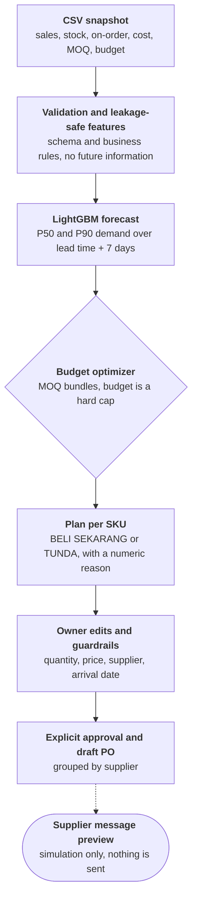

# Lumbung

Lumbung is a local-first AI replenishment copilot for growing independent retailers. It turns sales history, current stock, purchase constraints, and a store budget into a reviewable **Beli Sekarang** or **Tunda** plan for every SKU.

This repository contains the preliminary MVP: one CSV upload, one synchronous AI recommendation, and a browser-only approval simulation. The owner can edit quantity, demo supplier, price, and requested arrival date before approving a draft purchase order. Lumbung does not contact a supplier or purchase anything. The broader product direction is documented in [LUMBUNG-PLAN.md](LUMBUNG-PLAN.md).

## Handover status

- The backend, frontend, sample upload, approval workflow, and supplier-message simulation have passed a local non-Docker browser run on desktop and mobile layouts.
- Backend tests, Python lint, frontend lint, frontend production build, and the release verifier pass.
- The Docker definitions are complete and `docker compose config` is valid.
- A final clean Docker runtime test is still pending. The last retry was interrupted by a Docker Desktop host storage error (`read-only file system`), not an application test failure.

A teammate should be able to run the project on another machine with a healthy Docker installation. Treat that first clean Compose run as the final portability check.

## Quick start with Docker

Requirements:

- Docker Desktop or Docker Engine with Compose v2;
- internet access for the first image build;
- free host ports `3000` and `8000`.

From the repository root:

```bash
docker compose up --build
```

Wait until the backend is healthy, then open:

- application: <http://localhost:3000>
- API health: <http://localhost:8000/health>
- interactive API documentation: <http://localhost:8000/docs>

In the application, download the sample CSV, upload it unchanged, and select **Buat rencana belanja**. The checked-in sample should return eight SKU recommendations, five **Beli Sekarang** decisions, and proposed spending of Rp2,495,000 from a Rp2,500,000 budget. Select **Tinjau dan siapkan draft** to test the local approval simulation.

Stop both services with:

```bash
docker compose down
```

No credentials, environment variables, database, or cloud service are required for this MVP.

## Local run without Docker

Python 3.12 or 3.13 and Node.js 22 are recommended.

Install dependencies once:

```powershell
python -m venv .venv
.venv\Scripts\Activate.ps1
python -m pip install -r backend/requirements-dev.txt
Set-Location frontend
npm ci
Set-Location ..
```

Run the backend in the first PowerShell terminal:

```powershell
.venv\Scripts\Activate.ps1
$env:PYTHONPATH = "backend"
uvicorn app.main:app --host 127.0.0.1 --port 8000
```

Run the frontend in a second PowerShell terminal:

```powershell
Set-Location frontend
npm run dev -- --host 127.0.0.1 --port 3000
```

Open <http://localhost:3000>. Vite proxies `/api/*` to the backend, so no temporary repository configuration is needed.

## What the MVP does



The AI forecasts, the deterministic optimizer decides quantity and budget feasibility, and the owner approves.

The frontend and backend are separate services. Nginx serves the production React interface and proxies `/api/*` to FastAPI. Model artifacts are checked in and loaded read-only at runtime.

## Input contract

The CSV must contain these exact columns:

| Column | Meaning | Validation |
|---|---|---|
| `date` | Daily observation date | Parseable and unique per SKU |
| `sku_id` | Store SKU identifier | Non-empty, with at least 28 observed days |
| `category` | Product category | Non-empty text |
| `sales_qty` | Units sold that day | Numeric and non-negative |
| `stock_on_hand` | Current units in store | Numeric and non-negative |
| `on_order` | Units already ordered | Numeric and non-negative |
| `unit_cost` | Purchase cost in IDR per unit | Numeric and non-negative |
| `unit_margin` | Expected margin in IDR per unit | Numeric and non-negative |
| `lead_time_days` | Supplier lead time | Integer of at least 1 |
| `moq` | Minimum order quantity | Integer of at least 1 |
| `available_budget` | Store purchase budget in IDR | One positive value repeated on every row |

The API rejects missing values, negative values, duplicate `sku_id + date` pairs, inconsistent budgets, non-CSV uploads, and files larger than 10 MB. Error responses follow Problem Details.

## Output contract

For each SKU, Lumbung returns:

- P50 and P90 demand for the supplier lead time plus a seven-day review period;
- current and on-order stock plus stockout risk;
- a deterministic `BELI_SEKARANG` or `TUNDA` decision;
- an MOQ-compliant quantity and cost;
- a numeric reason and priority score.

The complete response includes budget utilization, model and parameter versions, the data cutoff, review period, and a SHA-256 checksum of normalized input. The store owner remains responsible for every purchase approval.

## Approval simulation

The prototype adds a post-inference workflow without adding another AI input or network integration:

1. The owner opens the five recommended purchase lines.
2. The owner may edit quantity, unit price, demo supplier, and requested arrival date.
3. The browser blocks approval when quantity violates MOQ, price is invalid, the date has passed, or total spending exceeds the budget.
4. The owner confirms the final value and creates a draft PO.
5. Lumbung groups lines by demo supplier and prepares a message preview.
6. **Simulasikan pengiriman** changes local UI state only.

Supplier names and sending status are synthetic interface data. The browser does not call Telegram, WhatsApp, a POS, or any supplier API. Approval state disappears when the page reloads. This keeps the preliminary workflow synchronous and local, with one CSV as the core AI input. A real connector requires persistent approval records, idempotency, authentication, and an audited outbox.

## Verification

Backend and release checks:

```powershell
.venv\Scripts\Activate.ps1
$env:PYTHONPATH = "backend"
python -m pytest backend/tests -q --cov=backend/app
python -m ruff check backend scripts
python scripts/verify_release.py
```

Frontend checks:

```powershell
Set-Location frontend
npm run lint
npm run build
```

Validate the Compose file without starting containers:

```bash
docker compose config --quiet
```

## Model evidence

The checked-in LightGBM artifact was trained and evaluated on deterministic synthetic retail history. On a later temporal holdout containing 432 examples, it recorded mean P50/P90 pinball loss of `1.786392`, compared with `1.828699` for the moving-average baseline. P50 WAPE was `0.200564`, compared with `0.205738` for the baseline, and empirical P90 coverage was `0.891204`.

These results validate the supplied software and evaluation pipeline only. They do not establish stockout reduction, savings, product-market fit, or performance on Indonesian retail data. See [MODEL_CARD.md](MODEL_CARD.md) and `artifacts/model_metadata.json` for the evaluation design and limitations.

## Repository map

```text
artifacts/             Frozen models and machine-readable metadata
backend/app/           API, validation, features, inference, and optimizer
backend/tests/         Unit and API contract tests
data/                  Synthetic training history and upload-ready sample
docs/openapi.json      Versioned static API contract
frontend/              React interface and Nginx runtime
scripts/               Data generation, training, API export, release checks
docker-compose.yml     Local two-service runtime
LUMBUNG-PLAN.md        Consolidated product and technical roadmap
MODEL_CARD.md          Model evidence, safeguards, and limitations
CONTRIBUTING.md        Collaboration and repository rules
```

## Troubleshooting

- If a port is already used, stop the conflicting process or change the host-side port in `docker-compose.yml`.
- If the backend is unhealthy, run `docker compose logs backend` and confirm that `artifacts/replenishment_models.joblib` is present.
- If Docker Desktop reports storage, WSL, or read-only filesystem errors, restart Docker Desktop and free Docker storage before rebuilding. This is a host runtime issue.
- To clear stopped project containers without deleting source files, run `docker compose down --remove-orphans`.

Future POS or supplier connectors will require secrets. Put those values in a local `.env`; `.env` files are ignored and must never be committed.

## Responsible use

Lumbung never sends a purchase automatically in this MVP. Budget is a hard constraint, recommendations are reproducible, and explanations come from numeric inventory and model outputs. A real pilot requires store consent, inventory-accuracy checks, authorized local data, retraining, calibration, and measured operational baselines.
